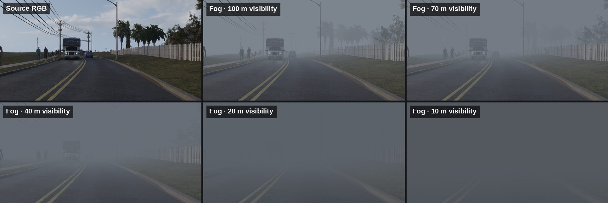
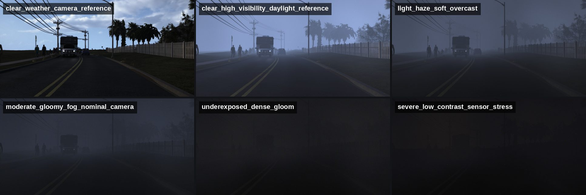

# euler-preprocess

Physics-based preprocessing transforms for multi-modal RGB+depth datasets — synthetic
fog, sky-depth normalisation, and planar-to-radial depth conversion. Built on
[euler-loading](https://github.com/d-rothen/euler-loading) and
[ds-crawler](https://github.com/d-rothen/ds-crawler).



*One input frame rendered at 100 m, 70 m, 40 m, 20 m and 10 m meteorological visibility
(`configs/fog_stepped_config.json`). Fog density follows the depth map, so the
attenuation is scene-consistent rather than a flat overlay.*



*The same frame through all six `scenario_profiles` in
`configs/dense_gloomy_daylight_fog_camera.json`. Each profile samples fog density,
airlight, exposure, sensor noise and compression together, so weather and camera
response stay correlated. The last two are deliberately extreme low-light stress
cases — their auto-exposure targets a mean luminance of ~0.1.*

Both sets were rendered with `tools/run_fog_qualitative_samples.py`, which runs a
folder of RGB/depth/segmentation samples through the transform and writes images for
qualitative review.

| Command | Description |
|---|---|
| `euler-preprocess fog` | Synthetic fog via the Koschmieder atmospheric scattering model |
| `euler-preprocess sky-depth` | Override depth values in sky regions with a constant |
| `euler-preprocess radial` | Convert planar (z-buffer) depth to radial (Euclidean) depth |

## Installation

```bash
uv pip install "euler-preprocess[gpu,progress]"
```

## Usage

```bash
euler-preprocess fog       -c configs/example_dataset_config.json
euler-preprocess sky-depth -c configs/sky_depth_dataset_config.json
euler-preprocess radial    -c configs/radial_dataset_config.json
```

## Dataset Config

Every subcommand takes a **dataset config** that points to the input data and to a
**transform config**. Each modality path must be a directory indexed by
[ds-crawler](https://github.com/d-rothen/ds-crawler) with an `euler_loading` property
naming the loader and function, so euler-loading can auto-select the dataset-specific
loader.

```json
{
  "transform_config_path": "fog_config.json",
  "output_path": "/path/to/output",
  "modalities": {
    "rgb": {"path": "/path/to/rgb", "split": "train"},
    "depth": "/path/to/depth",
    "semantic_segmentation": "/path/to/classSegmentation"
  },
  "hierarchical_modalities": {
    "intrinsics": {"path": "/path/to/intrinsics"}
  }
}
```

| Field | Description |
|---|---|
| `transform_config_path` | Path to the transform-specific config, relative to this file. `fog_config_path` is also accepted. |
| `output_path` | Output root used when no pipeline target overrides it. Optional if `pipeline.output_root` or `pipeline.output_targets[].path` supplies the destination. |
| `output_slot` | Optional slot selector when `pipeline.output_targets` has several entries. Defaults to `rgb` for `fog` and `depth` for `sky-depth` / `radial`. |
| `sample` | Optional 0-based dataset index. Only `dataset[sample]` is transformed — useful for small benchmark slices of large datasets. |
| `samples` | Optional multi-sample selector: a list of indices (`[0, 10, 20]`) or a slice object (`{"start": 0, "stop": 1000, "step": 2, "count": 100}`). `stop` is exclusive, `count` caps the result. Mutually exclusive with `sample`. |
| `modalities` | Modalities that participate in sample-ID intersection. Each value is a path string or an object with `path` and optional `split`. |
| `hierarchical_modalities` | Per-scene data (e.g. intrinsics), same format. Loaded once per scene and cached. |
| `pipeline` | Optional runtime routing block compatible with `euler-inference`. |

**Required modalities per transform:**

| Transform | `modalities` | `hierarchical_modalities` |
|---|---|---|
| `fog` | `rgb`, `depth`, `semantic_segmentation` | `intrinsics` when available; used for radial depth conversion and camera-profile optics |
| `sky-depth` | `depth`, `semantic_segmentation` | — |
| `radial` | `depth` | `intrinsics` |

When a modality directory contains ds-crawler split files
(`.ds_crawler/split_<name>.json`), set `split` on that modality to select a subset.
Sample IDs are intersected across modalities, so a split on one modality restricts the
whole dataset.

### Pipeline Runtime Block

`pipeline` follows the same shape as `euler-inference`:

```json
{
  "pipeline": {
    "output_root": "/pipeline/output",
    "outputs_manifest_path": "/pipeline/output/.euler_pipeline/pipeline_outputs.json",
    "output_targets": [
      {
        "slot": "depth",
        "datasetType": "depth",
        "relativePath": "radial_depth.zip",
        "path": "/pipeline/output/radial_depth.zip",
        "storage": "zip"
      }
    ]
  }
}
```

- `output_root` is only a fallback when `output_path` is omitted.
- A matching `output_targets[].slot` overrides the write root for that run.
- `output_targets[].modelModalityId` is optional and passed through when present.
- `storage` is `"directory"` or `"zip"`; `"file"` parses but is rejected at runtime.
- When `outputs_manifest_path` is set and a target matches, finalization writes
  `.euler_pipeline/pipeline_outputs.json` in the `euler-inference` manifest shape.

---

## Fog Transform

### Fog Config

```json
{
  "airlight": "from_sky",
  "seed": 1337,
  "depth_scale": 1.0,
  "resize_depth": true,
  "contrast_threshold": 0.05,
  "render_input_space": "srgb",
  "mode": "sample",
  "device": "cpu",
  "gpu_batch_size": 4,
  "capture": { "preset": "camera" },
  "camera_profile": "dashcam",
  "selection": { },
  "models": { }
}
```

| Field | Description |
|---|---|
| `airlight` | **Required.** `"from_sky"` (mean sky colour), `"dcp"` (dark channel prior), or `"dcp_heuristic"` (robust DCP with sky-guided colouring). |
| `seed` | Random seed for reproducibility; `null` for non-deterministic. |
| `depth_scale` | Multiplier applied to depth values after loading. |
| `resize_depth` | Bilinearly resize the depth map to the RGB resolution. |
| `contrast_threshold` | Threshold *C_t* in the visibility-to-attenuation conversion (default `0.05`). |
| `render_input_space` | Colour space of the input RGB. `"srgb"` for display-encoded images (fog is mixed in scene-linear RGB); `"linear"` for already-linear radiance. |
| `mode` | `"sample"` (default) renders one sampled scenario per image; `"progressive"` renders every scenario step for every image. |
| `device` | `"cpu"`, `"cuda"`, `"mps"`, or `"gpu"` (alias for cuda). |
| `gpu_batch_size` | Batch size on GPU. Uniform-model samples are batched; heterogeneous ones run individually. |
| `capture` | Post-fog camera artifact pipeline. Omit or use `{"stages": []}` for a no-op; `true` or `{"preset": "camera"}` enables the recommended stack. |
| `camera_profile` | Named or inline camera profile merged into the capture stack before per-stage overrides. Built-ins: `"default"`, `"generic"`, `"dashcam"`, `"low_light_fog"`. |
| `camera_profiles` | Map of project-specific named profiles for calibrated lens/sensor/ISP/transport settings. |
| `scenario_profiles` | Top-level correlated condition sampler (see below). |
| `selection` | Per-image fog model selection (see below). |
| `augmentations` | Stepped augmentation set. Every input produces every configured variant. |

### Fog Model

The core equation is the **Koschmieder model**:

```
I_fog(x) = I(x) * t(x)  +  L_s * (1 - t(x))
```

- **I(x)** — original RGB colour at pixel *x*
- **t(x) = exp(-k * d(x))** — transmittance, falling exponentially with depth *d*
- **L_s** — atmospheric light (airlight): the colour of light scattered toward the camera
- **k** — attenuation, derived from meteorological visibility *V* as `k = -ln(C_t) / V`

Distant objects are attenuated more (`t` approaches 0) and replaced by airlight, just
as in real fog.

Rendering happens in two phases. First the *ideal scene* is rendered: physics-based fog
plus auxiliary `scattering_coefficient` and `atmospheric_light` maps. Then *capture
artifacts* are applied to the rendered RGB only. Physical fog maps therefore stay
stable while the RGB output can receive exposure shifts, lens blur, sensor noise, ISP
processing, and compression.

### How Each Modality Is Used

**RGB** — the clean scene image, normalised to float32 in [0, 1]. This is *I(x)*.

**Depth** — a per-pixel depth map in **metres**, providing *d(x)*. Invalid values (NaN,
inf, negative) are clamped to zero, i.e. treated as infinitely close and receiving no
fog. Depth stays authoritative even where the semantic map says sky, unless
`sky_fog_path` is configured.

**Semantic Segmentation** — a per-pixel semantic map from which a boolean sky mask is
derived. Used for airlight estimation when `airlight` is `"from_sky"`: the mean RGB of
all sky pixels becomes *L_s*.

**Intrinsics** *(optional)* — when present, planar (z-buffer) depth is converted to
radial (Euclidean) depth before fog is applied.

For a bounded valley-fog treatment of sky, add `sky_fog_path` inside a model config:

```json
"sky_fog_path": {
  "mode": "layer",
  "camera_height_m": 1.6,
  "fog_valley_peak_m": 80.0,
  "camera_pitch_deg": 0.0,
  "camera_roll_deg": 0.0,
  "density_profile": "linear_fade",
  "transition_height_m": 10.0,
  "max_path_m": 1000.0
}
```

Pixel rays are reconstructed from the intrinsics: near-horizon rays accumulate long
paths through the fog layer while upward rays exit it sooner. `linear_fade` keeps full
density below `transition_height_m` and decreases linearly to zero at
`fog_valley_peak_m`; `uniform` keeps full density up to the top. Positive
`camera_pitch_deg` points the optical axis upward, and `max_path_m` bounds horizon
rays. The original depth is retained for non-sky pixels and capture effects. Enabling
this without intrinsics raises an error rather than silently falling back.

### Airlight Estimation

| Method | Description |
|---|---|
| `from_sky` | Mean RGB of sky pixels. Falls back to white `[1, 1, 1]` when no sky pixels exist. |
| `dcp` | Dark Channel Prior — brightest pixel (by channel sum) among the top 0.1% darkest-channel pixels. |
| `dcp_heuristic` | Robust DCP — pools the brighter half of the top 0.1% darkest-channel pixels; when sky pixels exist their brightest colours act as a chromaticity prior while DCP-derived luminance is preserved. |

GPU-native implementations are selected automatically when running on GPU. With
`dcp_heuristic` you can add:

```json
"dcp_heuristic": {
  "patch_size": 15,
  "top_percent": 0.001,
  "white_bias": 0.1,
  "cool_bias": 0.15,
  "cool_target": [0.93, 0.97, 1.0]
}
```

`white_bias` mixes the result toward neutral white and `cool_bias` toward a
sky-relative cool target derived from `cool_target`; their sum must be `<= 1`. The tint
bias preserves luminance, so it shifts colour without changing fog density.

#### Intensity dampening

Estimated airlight is dampened by default as fog density increases, keeping strong fog
closer to the low grey lighting seen in real in-car footage instead of washing toward
white. Each model can override the curve:

```json
"airlight_dampening": {
  "enabled": true,
  "apply_to": "estimated",
  "reference_visibility_m": 80.0,
  "min_factor": 0.45,
  "max_factor": 1.0,
  "strength": 1.0
}
```

The factor is
`min_factor + (max_factor - min_factor) / (1 + strength * beta / reference_beta)`, where
`reference_beta` comes from `reference_scattering_coefficient` / `reference_beta` or is
derived from `reference_visibility_m`. Values above `1.0` are allowed when you want to
brighten estimated airlight; the final RGB is still clamped. The default applies only
to estimated airlight methods — literal RGB `atmospheric_light` values stay exact
unless `apply_to` is `"all"`. Set `"enabled": false` or `apply_to: "none"` to disable.

For `heterogeneous_ls` and `heterogeneous_k_ls`, the Perlin atmospheric-light field is
sampled around the dampened base airlight.

### Model Selection

```json
"selection": {
  "mode": "weighted",
  "weights": {
    "uniform": 0.25,
    "heterogeneous_k": 0.35,
    "heterogeneous_ls": 0.25,
    "heterogeneous_k_ls": 0.15
  }
}
```

`fixed` mode always uses a single named model; `weighted` picks one per image according
to normalised weights.

| Model | Description |
|---|---|
| `uniform` | Constant *k* and *L_s*. Standard homogeneous fog. |
| `heterogeneous_k` | Spatially-varying *k*, constant *L_s*. Patchy fog / fog banks. |
| `heterogeneous_ls` | Constant *k*, spatially-varying *L_s*. Scattered-light colour variation. |
| `heterogeneous_k_ls` | Both vary spatially. Most expressive model. |

Each model samples a `visibility_m` distribution per image:

| `dist` | Parameters |
|---|---|
| `constant` | `value` |
| `uniform` | `min`, `max` |
| `normal` | `mean`, `std`, optional `min`/`max` |
| `lognormal` | `mean`, `sigma`, optional `min`/`max` |
| `choice` | `values`, optional `weights` |

The sampled visibility *V* becomes `k = -ln(C_t) / V`, once per output image. For the
heterogeneous-*k* models that value is the base coefficient, which the noise field then
modulates spatially.

### Heterogeneous Noise Fields

`k_hetero` and `ls_hetero` use Perlin FBM to generate spatially-varying factor fields.
For realistic fog, prefer the smooth mode: Perlin wavelengths stay tied to the image
size, noise contrast is reduced, and an optional blur is applied before mapping noise
to physical factors.

```json
"k_hetero": {
  "scales": "smooth_auto",
  "correlation_length_fraction": 0.25,
  "octaves": 3,
  "max_scale": null,
  "min_factor": 0.65,
  "max_factor": 1.45,
  "contrast": 0.65,
  "smooth_sigma_fraction": 0.0,
  "normalize_to_mean": true
}
```

| Parameter | Effect |
|---|---|
| `min_factor` / `max_factor` | Range of the multiplicative factor. |
| `normalize_to_mean` | Rescale factors so the image-wide mean equals the base value. Recommended for `k_hetero`. |
| `scales: "smooth_auto"` | Build low-frequency Perlin scales from the image size. |
| `correlation_length_fraction` | Smallest fog feature size as a fraction of the shorter image side. Larger is smoother. |
| `octaves` / `lacunarity` / `max_scale` | How many increasingly broad Perlin components are mixed. |
| `contrast` | Compress or expand the Perlin range before mapping to factors. Below 1 recommended. |
| `smooth_sigma` / `smooth_sigma_fraction` | Optional final Gaussian blur, in pixels or as a fraction of the shorter side. |
| `ls_gradient` | Optional `L_s` top-to-bottom or left-to-right factor field. Keep it weak and probabilistic so it does not become an image-position shortcut. |

The noise field (in [0, 1]) maps to
`factor(x) = min_factor + (max_factor - min_factor) * noise(x)`, and with heterogeneous
*k* the result is `k(x) = k_sampled * factor(x)`. With `normalize_to_mean: true` the
arithmetic mean of the per-pixel *k* map equals `k_sampled` (the median is not forced to
match); with `false`, the map mean shifts by the mean of the factor field.

`ls_hetero` can add a weak view-direction illumination prior that modulates the
atmospheric-light field itself, so the rendered effect is still gated by transmittance:

```json
"ls_hetero": {
  "ls_gradient": {
    "enabled": true,
    "probability": 0.65,
    "axis": "vertical",
    "top_factor": {"dist": "uniform", "min": 1.03, "max": 1.14},
    "bottom_factor": {"dist": "uniform", "min": 0.88, "max": 0.99},
    "gamma": {"dist": "uniform", "min": 0.85, "max": 1.6},
    "normalize_to_mean": true,
    "fog_opacity_weight": 0.65
  }
}
```

### Scene Illumination

For gloomy conditions, add `scene_illumination` inside a fog model config. It darkens
pre-fog scene radiance *I(x)* before the scattering equation, so near objects become
plausibly overcast or storm-lit instead of passing through unchanged. `global_ev`
applies to the whole non-sky scene, `near_ev` adds near-field darkening with
`near_decay_depth_m`, `fog_coupled_ev` adds a term proportional to local fog opacity,
and `sky_weight: 0.0` preserves sky pixels when a sky mask is available.

### Capture Artifact Stack

Enable the recommended camera stack with `"capture": {"preset": "camera"}` (or
`"capture": true`). For tighter control, list explicit stages in camera order:

```json
"capture": {
  "stages": [
    {
      "type": "optics",
      "blur_sigma": {"dist": "uniform", "min": 0.2, "max": 0.8},
      "vignetting_strength": 0.15,
      "windshield_haze": {"enabled": true, "probability": 0.4}
    },
    {
      "type": "sensor",
      "input_space": "srgb",
      "exposure_gain": {"dist": "uniform", "min": 0.85, "max": 1.2},
      "row_noise_sigma": 0.003
    },
    {"type": "isp", "tone_map": "reinhard", "gamma": "srgb", "sharpen_amount": 0.2},
    {
      "type": "transport",
      "jpeg": {"enabled": true, "quality": {"dist": "uniform", "min": 65, "max": 92}},
      "bit_depth": 8
    }
  ]
}
```

| Stage | Main effects |
|---|---|
| `optics` | Defocus/MTF blur, motion blur, bloom, veiling glare, vignetting, chromatic aberration, lens distortion, windshield haze, optional droplets. |
| `sensor` | Image-driven or sampled exposure, white balance, camera matrix, Bayer mosaic, shot/read noise, fixed-pattern noise, row/column banding, shadow-local recovery noise, hot/dead pixels, bilinear demosaic. |
| `isp` | Denoising, colour correction, tone mapping, sRGB/gamma, local contrast, sharpening halos, saturation shifts. |
| `transport` | Crop/resize, bit-depth quantization, JPEG round-trip compression. |
| `exposure` | Lightweight standalone exposure and white-balance stage for simple custom chains. |

`camera_profiles` holds reusable named versions of the same settings; see
`configs/dense_gloomy_daylight_fog_camera.json` for a fully specified dashcam profile.

Four opt-in `sensor` blocks cover most of the realism tuning:

| Block | Purpose | Key settings |
|---|---|---|
| `auto_exposure` | Meters the rendered image before raw sensor sampling. `exposure_gain` still applies on top as scenario compensation. | `target_luminance`, `metering`, `highlight_*`, gain bounds, `resolve_iso` (raises ISO from metering pressure, dark pixel fraction, and fog opacity) |
| `sensor_identity` | Persistent sensor structure across frames, deterministic per `sensor_id` / `seed` / shape / Bayer pattern. | `prnu_sigma` (pixel-response non-uniformity before shot noise), `dsnu_sigma`, `persistent_row_sigma`, `persistent_column_sigma`, persistent hot/dead pixel probabilities |
| `shadow_recovery_noise` | Corrupts luma and chroma only where pre-exposure luminance was low — less global grain, visibly noisy lifted shadows. | `luma_sigma`, `chroma_sigma`, `chroma_mode`, `red_chroma_gain`, `blue_chroma_gain`, `chroma_axis_correlation`, `black_noise_floor`, `black_suppression_*` |
| `noise_adjustment` | Scales the selected profile's noise relatively. | `level` (`1.0` = unchanged), `static_chroma_bias` from `-1.0` (fixed-pattern, banding, bad pixels) to `1.0` (chromatic high-ISO shadow noise) |

The fog-aware metering modes (`"fog_aware_center_weighted"`,
`"sky_aware_center_weighted"`) additionally read `CaptureContext.depth_m`, `k_map`, fog
opacity, and `attributes.sky_mask`. Tune `sky_suppression`, `fog_meter_suppression`,
`depth_meter_decay_m`, and `min_meter_weight` to keep bright sky or dense far-field
airlight from dominating the meter; legacy metering modes are unchanged unless these
keys are present.

For dark high-ISO scenes, keep `shadow_recovery_noise.luma_sigma` well below
`chroma_sigma`, use `chroma_mode: "balanced"`, and leave
`chroma_luminance_preservation` near `1.0` so the corruption reads as colour noise
rather than black speckle. Keep `chroma_spatial_sigma` near `0` for fine-grained rather
than blocky noise.

**Condition profiles.** Any stage can define `condition_profiles` to sample coherent
per-image settings before it runs — useful when ISO, exposure gain, read noise, banding,
and dark/fog modulation should move together:

```json
{
  "type": "sensor",
  "condition_profiles": [
    {"name": "clean_daylight", "weight": 0.25, "exposure_gain": 1.0, "iso": 100},
    {"name": "underexposed_noisy", "weight": 0.25, "exposure_gain": 0.65, "iso": 1600}
  ]
}
```

**Tone mapping.** `isp.tone_map` supports `"reinhard"`, `"aces"`, `"clip"`, and
`"lut"`. The LUT mode interpolates a cheap 1D camera-response curve given by
`tone_map_lut` and interpreted in `tone_map_lut_domain`.

For `"lut"` and `"aces"`, `tone_map_strength` is an **exponent on the curve's
response**, not a linear blend: `0` leaves the image unchanged, `1` applies the
curve exactly, and values above `1` apply it more strongly. Because the blend is
geometric, output radiance stays strictly non-negative at any strength. For
`"reinhard"` the strength is a curve parameter (`x / (1 + strength * x)`) as
before.

### Scenario Profiles

Top-level `scenario_profiles` sample one latent scene/camera condition before rendering.
The selected scenario is merged over the root config, so it can drive fog density,
atmospheric light, camera profile, capture overrides, ISP, and compression together:

```json
"scenario_profiles": [
  {
    "name": "underexposed_dense_gloom",
    "weight": 0.25,
    "model": "heterogeneous_k_ls",
    "airlight_method": "dcp_heuristic",
    "models": {
      "heterogeneous_k_ls": {
        "visibility_m": {"dist": "uniform", "min": 18.0, "max": 55.0},
        "scene_illumination": {
          "enabled": true,
          "global_ev": {"dist": "uniform", "min": 0.25, "max": 0.85},
          "near_ev": {"dist": "uniform", "min": 0.35, "max": 1.20},
          "near_decay_depth_m": {"dist": "uniform", "min": 10.0, "max": 22.0},
          "fog_coupled_ev": {"dist": "uniform", "min": 0.10, "max": 0.45},
          "sky_weight": 0.0
        }
      }
    },
    "capture_overrides": {
      "sensor": {
        "condition_profile": "underexposed_noisy",
        "auto_exposure": {
          "enabled": true,
          "metering": "fog_aware_center_weighted",
          "target_luminance": {"dist": "uniform", "min": 0.13, "max": 0.20},
          "sky_suppression": 0.85,
          "fog_meter_suppression": 0.65
        }
      },
      "transport": {"jpeg": {"quality": {"dist": "uniform", "min": 54, "max": 78}}}
    }
  }
]
```

`capture_overrides` is merged after camera-profile and stage settings. Use
`condition_profile` to force one named profile from a stage's `condition_profiles`; if
omitted, the stage keeps sampling its own weights locally.
`configs/dense_gloomy_daylight_fog_camera.json` contains a complete six-profile set
covering clear weather through severe sensor stress — the profiles shown in the header
images.

### Progressive Mode

Set `"mode": "progressive"` to emit every configured scenario for every input image
instead of sampling one. Each scenario accepts `"steps"` and `"progressive_weight"`
(aliases: `"max_weight"`, `"weight"`); the transform writes steps from weight `0`
through the scenario's configured weight, where weight `1` matches the original
scenario. Fog density progresses in scattering-coefficient space while numeric
camera/config values blend from the base config toward the scenario config. Blends
clamp probability-like values and non-negative physical factors back into valid domains,
so extrapolated weights above `1` cannot produce invalid render parameters.
Source-backed outputs are written as `fog_progression` variants under each source file
id.

### Stepped Augmentations

For benchmark generation, set `augmentations`. The fog transform then produces one
output per configured variant instead of one sampled output per input:

```json
{
  "airlight": "from_sky",
  "seed": 1337,
  "contrast_threshold": 0.05,
  "augmentations": {
    "file_id_hierarchy_name": "file_id",
    "attribute_key": "fog_augmentation",
    "models": ["uniform"],
    "visibility_m": [10, 20, 40, 70, 100],
    "airlight_methods": ["from_sky"]
  }
}
```

The matrix form expands as the Cartesian product of `models`, `visibility_m` (MOR in
metres), optional `scattering_coefficients` / `beta`, and airlight choices.
`file_id_hierarchy_name` names the inserted hierarchy level when the ds-crawler writer
has a hierarchy separator; the directory name is the source file id either way. For
tighter control, use explicit `variants` instead:

```json
"augmentations": {
  "variants": [
    {
      "id": "mor_010m_sky",
      "model": "uniform",
      "visibility_m": 10,
      "airlight_method": "from_sky"
    },
    {
      "id": "beta_0.15_white",
      "model": "heterogeneous_k",
      "scattering_coefficient": 0.15,
      "atmospheric_light": [1.0, 1.0, 1.0],
      "k_hetero": {"scales": "smooth_auto", "min_factor": 0.65, "max_factor": 1.45}
    }
  ]
}
```

Each output receives per-file ds-crawler attributes under `fog_augmentation` — the
augmentation id, source id and full id, model, actual scattering coefficient, actual
atmospheric light, and configured MOR/beta descriptors. euler-loading exposes these as
`sample["attributes"]["rgb"]["fog_augmentation"]`.

### Output

CLI runs write a source-backed RGB dataset that keeps the source dataset's relative
paths, basenames, extensions, and ds-crawler metadata, so the result stays loadable by
euler-loading:

```
<output_path>/
  .ds_crawler/dataset-head.json
  .ds_crawler/ds-crawler.json
  .ds_crawler/index.json
  Scene01/Camera_0/00000.png
```

With `augmentations` enabled, outputs are written one level below the source file id:

```
<output_path>/
  Scene01/Camera_0/00000/
    mor_10m_airlight_from_sky.png
    mor_20m_airlight_from_sky.png
```

Auxiliary `scattering_coefficient` and `atmospheric_light` pipeline targets use the same
file-id hierarchy and write matching `.npy` files.

When a pipeline target is present, `pipeline.output_targets[].path` replaces
`output_path` entirely. Standalone `FogTransform(...)` usage without the CLI keeps the
legacy per-model layout with `config.json` sidecars.

---

## Sky-Depth Transform

Overrides depth values in sky regions with a configurable constant. Useful for datasets
where sky depth is encoded as zero or infinity and needs a large finite value.

```json
{
  "sky_depth_value": 1000.0
}
```

`sky_depth_value` defaults to `1000.0`.

CLI runs write a source-backed depth dataset mirroring the input depth modality's paths,
filenames, extensions, and metadata. Standalone `SkyDepthTransform(...)` usage keeps the
legacy `.npy` output behaviour.

---

## Radial Transform

Converts planar (z-buffer) depth to radial (Euclidean) depth using camera intrinsics.
For each pixel *(u, v)*:

```
d_radial(u, v) = d_planar(u, v) * sqrt(((u - cx)/fx)^2 + ((v - cy)/fy)^2 + 1)
```

The transform config takes no parameters (`{}`); intrinsics are read from the
`intrinsics` hierarchical modality.

CLI runs write a source-backed depth dataset mirroring the input depth modality's layout
and writer metadata, with `meta.radial_depth` set to `true` in the emitted `index.json`.
Standalone `RadialTransform(...)` usage keeps the legacy `.npy` output behaviour.

---

## License

[MIT](LICENSE) © Daniel Rothenpieler
